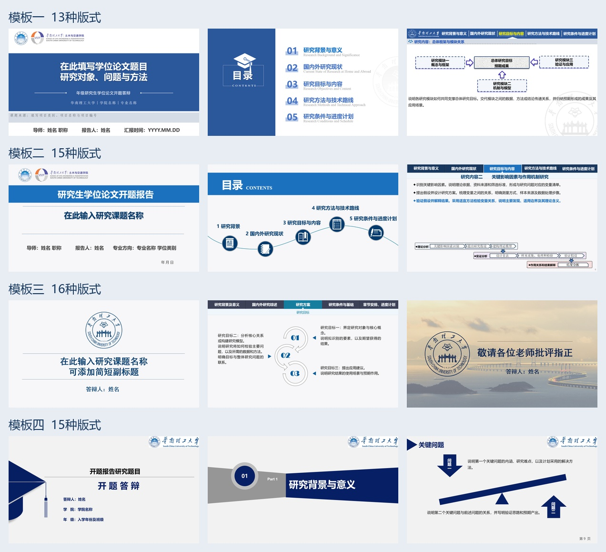

# 华工学术 PPT 技能

用于制作论文汇报和开题答辩，技能名为 `scut-paper-ppt`。



## 包含内容

- 华工蓝通用模板。
- 模板一、模板二、模板三、模板四，共 59 张开题答辩版式。
- 可编辑 PPTX、POTX、配图素材、逐页预览和版式索引。
- 内容组织、按原版编辑、章节导航和视觉检查的技能说明。

## 直接使用模板

下载并解压仓库，打开 [版式索引](assets/defense-templates/版式索引.html)，选择需要的 PPTX 或 POTX，用 PowerPoint 或 WPS 编辑。

## 在 Codex 中使用

下载并解压本仓库，将 `scut-paper-ppt` 整个文件夹放入个人 skills 目录：

- Windows：`%USERPROFILE%\.agents\skills\scut-paper-ppt`
- macOS / Linux：`~/.agents/skills/scut-paper-ppt`

也可以在 Windows PowerShell 中安装：

```powershell
New-Item -ItemType Directory -Force "$env:USERPROFILE\.agents\skills" | Out-Null
git clone https://github.com/cuijerdaye-hub/scut-paper-ppt.git "$env:USERPROFILE\.agents\skills\scut-paper-ppt"
```

确认该文件夹内直接包含 `SKILL.md`。如果已有同名技能，先保留原有版本，再替换为本包。Codex 会检测技能变更；如列表未更新，可重启 Codex。[官方技能安装位置说明](https://learn.chatgpt.com/docs/build-skills#where-codex-loads-local-skills)

提供自己的论文或开题报告，并输入：

> 请用 $scut-paper-ppt，选择模板二，根据这份开题材料制作约15页可编辑PPT，并核对章节导航和页面布局。

也可以先让 Codex 展示四套模板预览，再选择编号。

## 运行与预览

直接编辑模板需要 PowerPoint 或 WPS。自动制作需要支持本地 skills 和演示文稿操作的 Codex 环境；首次使用时由 Codex 检查可用工具及运行依赖。

随包的自动预览脚本面向 Windows，需要本机 WPS 演示和 pywin32。专用渲染脚本使用 Codex 捆绑的运行库；具体环境不同时需调整路径或采用可用的演示文稿编辑工具。模板一至四按技能中的副本编辑流程使用。换电脑后应检查字体与排版。

## 直接查看模板

| 模板 | 页数 | 可编辑文件 | 预览 |
|---|---:|---|---|
| 模板一 | 13 | [PPTX](assets/defense-templates/模板一.pptx) · [POTX](assets/defense-templates/模板一.potx) | [全部页面](assets/defense-templates/模板一_全页预览.jpg) |
| 模板二 | 15 | [PPTX](assets/defense-templates/模板二.pptx) · [POTX](assets/defense-templates/模板二.potx) | [全部页面](assets/defense-templates/模板二_全页预览.jpg) |
| 模板三 | 16 | [PPTX](assets/defense-templates/模板三.pptx) · [POTX](assets/defense-templates/模板三.potx) | [全部页面](assets/defense-templates/模板三_全页预览.jpg) |
| 模板四 | 15 | [PPTX](assets/defense-templates/模板四.pptx) · [POTX](assets/defense-templates/模板四.potx) | [全部页面](assets/defense-templates/模板四_全页预览.jpg) |

网页上的 HTML 文件可下载后本地打开；上表图片预览可直接在 GitHub 查看。

## 许可证与素材

原创技能说明和辅助代码采用 [MIT License](LICENSE)。学校标识、校园图片和模板原有视觉素材的说明见 [素材说明](THIRD_PARTY_NOTICES.md)。
